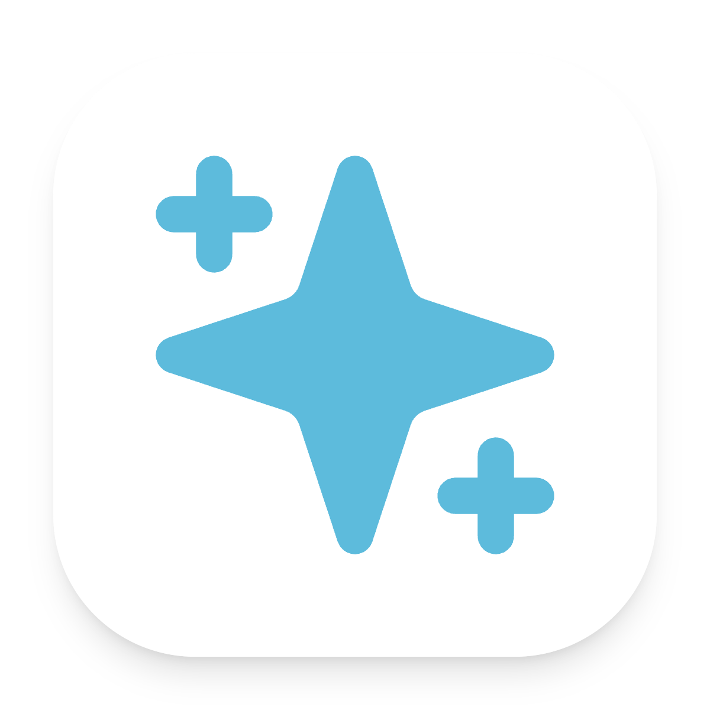

<p align="center">
  
</p>

<h1 align="center">AG99</h1>

<p align="center"><strong>Persona-first 多平台对话 Runtime</strong></p>

<p align="center">
  由 YakumoAki 创建，基于 AstrBot 独立演进，为连续对话、复杂执行与受控主动性提供统一运行时。
</p>

<p align="center">
  <code>Persona-first</code> · <code>Multi-platform</code> · <code>Bounded initiative</code>
</p>

<p align="center">
  <a href="#快速开始">开始使用</a> ·
  <a href="./docs/Yakumo/project-identity.md">认识 AG99</a> ·
  <a href="./docs/README.md">完整文档</a> ·
  <a href="https://github.com/murphys7017/AG99/issues">问题反馈</a>
</p>

---

## 核心定位

AG99 把 Persona 作为所有用户可见输出的统一边界。即时回复、插件材料、任务进度和 Core 最终
结果均由同一表达层处理；工具、检索、定时任务和其他复杂执行留在 Core 中完成。

它的目标不是再增加一套 Agent，而是在 AstrBot 的平台、Provider、插件、Dashboard 与 CLI 基础
设施上，为交互状态、上下文投影、执行回流和主动表达建立清晰的运行时职责。

## 运行模型

```text
Platform message
  -> Personal Response Plan
      -> reply ---------------------> Persona Expression -> Output
      -> delegate -> Core execution -> Persona Expression -> Output
      -> silent (eligible group only)
```

| 层级 | 职责 |
| --- | --- |
| **Personal Response Plan** | 为当前消息选择 `reply`、`delegate` 或允许场景下的 `silent`。 |
| **Core** | 执行已委派的工具、检索、计划任务与其他复杂工作。 |
| **Persona Expression** | 统一生成所有用户可见的自然语言与结构化表现。 |
| **Prompt Runtime** | 按调用阶段投影所需事实，避免轻量表达携带完整执行上下文。 |
| **Observation Runtime** | 通过 Gate、Policy 与 ActionIntent 约束可选的主动表达。 |

## 主要能力

| 能力 | 说明 |
| --- | --- |
| **统一表达** | 即时回复、插件 Persona 输出、任务进度与最终结果共用 Persona Expression。 |
| **分层执行** | 轻量表达不必进入 Core；仅已委派的任务才进入 Planner 与执行链。 |
| **阶段化上下文** | Persona 在计划、进度、最终结果和主动表达阶段使用不同的 Context View。 |
| **受控主动性** | Observation 不能直接调用工具或发送消息，必须经过确定性的 Gate 与 Policy。 |
| **兼容基础设施** | 继续复用 AstrBot 的平台适配器、Provider、插件、Dashboard 与 CLI。 |

## 与官方 AstrBot：同一生态，不同重心

AG99 不是 AstrBot 的替代品，也不以复制上游为目标。它保留 AstrBot 的生态与基础能力，并将
持续 Persona、统一表达和 Core 回流作为独立的运行时设计重点。

| 对比维度 | 官方 AstrBot | AG99 |
| --- | --- | --- |
| **公开定位** | 面向个人与群聊的 Agentic AI 助手，强调 IM 接入、插件扩展与通用 Agent 能力编排。 | Persona-first 多平台对话 Runtime，把“持续存在的交互主体”作为产品体验的起点。 |
| **AI 能力组织** | Chat Provider 负责模型回复，Agent Runner 负责多轮规划、工具调用与执行。 | 保留并复用这些能力，但由 Personal Response Plan 决定何时直接表达、何时委派 Core；Core 结果必须回到 Persona。 |
| **Persona 的位置** | 内置 Agent Runner 可以使用 Persona 功能。 | Persona 是所有用户可见表达的统一入口，并覆盖即时回复、任务进度、最终结果和受控主动表达。 |
| **主动与状态** | 提供可扩展的 Bot、插件和 Agent 基础能力。 | 将 Observation、Gate、Policy 与 ActionIntent 作为显式边界，让主动性在可检查的约束下发生。 |
| **适合谁** | 想快速接入 IM、模型、插件和通用 Agent 能力的用户。 | 想在这些能力之上，强化对话身份、状态边界和输出一致性的用户。 |

官方 AstrBot 仍是 AG99 的兼容基础与上游参考。若你的目标是接入一个成熟、可扩展的 AI Bot，
[AstrBot](https://docs.astrbot.app/) 已提供完整的平台、Provider、插件和 Agent 路径；若你更在意
对话身份、状态边界和表达一致性的控制，AG99 提供了另一条实现路径。

## 快速开始

前提：Python `3.12+`，以及 [uv](https://docs.astral.sh/uv/getting-started/installation/)。

```bash
uv sync
uv run main.py
```

启动后打开 `http://localhost:6185` 进入 Dashboard。首次启动生成的账号和密码会输出到控制台；
配置 Provider 与消息平台适配器后，就可以开始建立自己的 Persona 对话体验。

- [源码部署指南](./docs/zh/deploy/astrbot/cli.md)
- [消息平台接入](./docs/zh/platform/start.md)
- [Provider、平台与 Dashboard 文档](./docs/README.md)

开发 Dashboard 时：

```bash
cd dashboard
pnpm install
pnpm dev
```

## 想了解得更深

- [AG99 项目身份](./docs/Yakumo/project-identity.md)：项目定位，以及与 AstrBot 的兼容边界。
- [Yakumo 架构索引](./docs/Yakumo/README.md)：当前运行时边界、模块说明与推荐阅读顺序。
- [当前状态](./docs/Yakumo/current-state.md)：已实现能力、仍在验证的边界和准确限制。
- [Interaction Runtime](./docs/Yakumo/modules/interaction.md)：Persona、Core、插件与输出如何协作。
- [Structured Prompt](./docs/Yakumo/modules/prompt.md)：不同阶段如何只看到自己真正需要的上下文。
- [Persona Effect](./docs/zh/dev/star/guides/persona-effects.md) 与 [Prompt Extension](./docs/zh/dev/star/guides/prompt-extensions.md)：扩展 Persona 表现与结构化上下文的插件协议。

## 开发状态

AG99 正在持续开发。Personal Runtime、Persona Expression、结构化 Prompt 和 Core 执行边界
已经接入实际链路；不同 Provider 的结构化输出、外部执行器的流式投递，以及各平台的真实取消
和迟到结果场景仍在持续验证。

AG99 与上游 AstrBot 共用成熟的基础设施，但不是上游的稳定替代品。部署到真实平台前，请先在
自己的 Provider、平台适配器和插件组合上完成验证；运行时行为以本仓库源码与
[Yakumo 架构文档](./docs/Yakumo/) 为准。

## 许可证与来源

AG99 基于 AstrBot 独立演进，使用 `AGPL-3.0-or-later` 许可证，并继续遵守适用的 AstrBot
兼容说明。

- [LICENSE](./LICENSE)
- [EULA](./EULA.md)
- [AstrBot 上游仓库](https://github.com/AstrBotDevs/AstrBot)
- [AstrBot 官方文档](https://docs.astrbot.app/)
